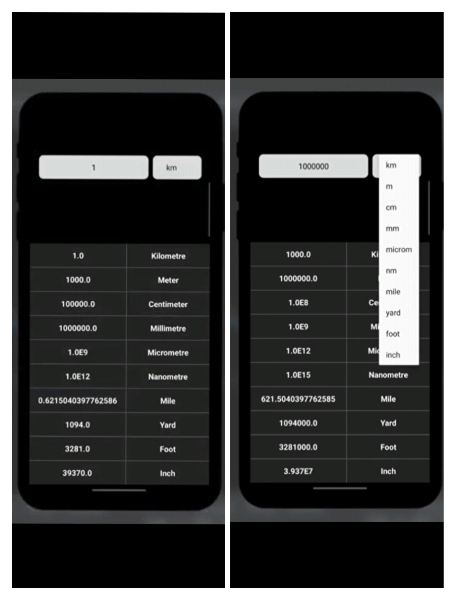

# Unit Convertor App

The Unit Convertor app is a mobile application developed using Android Studio and Java. It provides a user-friendly interface for converting the units. 

## Screenshots.

### Home Page.

